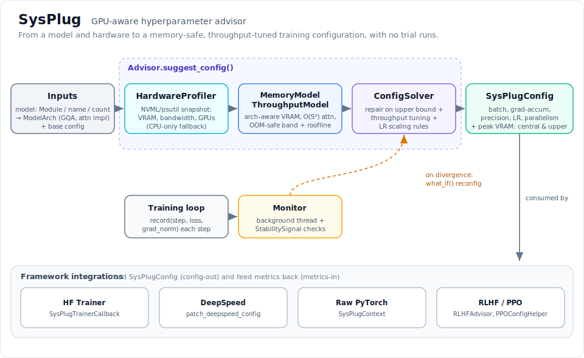

# SysPlug

[](https://github.com/arpitsinghgautam/sysplug/actions/workflows/tests.yml)
[](https://opensource.org/licenses/MIT)
[](https://www.python.org/downloads/)
[](https://github.com/astral-sh/ruff)
[](https://mypy-lang.org/)

<!-- The PyPI and Codecov badges are intentionally omitted until the package is
     published to PyPI and the repository is connected to codecov.io. -->



**GPU-aware hyperparameter advisor for any deep learning training loop.**

SysPlug analyses your GPU hardware, estimates memory and throughput requirements, and recommends the optimal batch size, learning rate, precision, gradient accumulation, and parallelism strategy for your training run, before you waste hours hitting OOM or under-utilizing hardware.

## Quick Start

```bash
pip install sysplug
```

```python
import sysplug

advisor = sysplug.Advisor(model=model, training_type="sft")

# Get an optimised configuration
cfg = advisor.suggest_config({"batch_size": 8, "learning_rate": 2e-5})

# What if I try a larger batch?
result = advisor.what_if({"batch_size": 32})
print(result.changed_params)   # shows what changed and why

# Monitor training in real time
with advisor.monitor(check_interval_steps=100) as mon:
    for step, batch in enumerate(dataloader):
        loss = train_step(batch)
        mon.record(step=step, loss=loss.item())
```

## Installation

```bash
# Core
pip install sysplug

# With Hugging Face Trainer integration
pip install sysplug[hf]

# With DeepSpeed integration
pip install sysplug[deepspeed]

# Development
pip install sysplug[dev]
```

## API Reference

### `Advisor`

The main entry point.

```python
advisor = sysplug.Advisor(
    model,                          # nn.Module, string ("llama-3-8b"), or int
    hardware="auto",                # "auto" or HardwareSnapshot
    training_type="supervised",     # "sft"|"rlhf"|"dpo"|"grpo"|"supervised"
    objective="balanced",           # "throughput"|"memory"|"balanced"
    verbose=True,
    device_ids=None,                # list of GPU IDs; None = all
)
```

#### `suggest_config(base_config: dict) -> SysPlugConfig`

Returns the best safe configuration for the given starting point. Runs hardware profiling → memory estimation → constrained optimisation.

#### `what_if(change: dict, current_config=None) -> WhatIfResult`

Evaluates a proposed change, locking the specified parameters and re-solving the rest. Returns `WhatIfResult` with `new_config`, `changed_params`, `reason`, and `feasible`.

#### `monitor(check_interval_steps=50, reconfig_policy="suggest") -> Monitor`

Returns a context manager that runs GPU polling and stability checks in a background thread.

### `SysPlugConfig`

The output type of `suggest_config`. Key methods:

| Method | Description |
|--------|-------------|
| `to_dict()` | Serialise to a plain dict |
| `to_training_arguments(**kwargs)` | Create `transformers.TrainingArguments` |
| `to_deepspeed_config(base_config)` | Merge into a DeepSpeed config dict |
| `apply_to_optimizer(optimizer)` | Set LR on an existing optimizer |
| `summary()` | Rich-formatted table |

### Framework Integrations

#### Hugging Face Trainer

```python
from sysplug.integrations.huggingface import SysPlugTrainerCallback

trainer = Trainer(
    ...,
    callbacks=[SysPlugTrainerCallback(advisor)],
)
```

#### DeepSpeed

```python
from sysplug.integrations.deepspeed import patch_deepspeed_config

ds_config = patch_deepspeed_config(my_ds_config, advisor)
```

#### RLHF / PPO

```python
from sysplug.integrations.rlhf import RLHFAdvisor, PPOConfigHelper

advisor = RLHFAdvisor(model=policy, training_type="rlhf")
advisor.record_reward(step, mean_reward=0.7, reward_std=0.1)
advisor.record_kl(step, kl_divergence=0.3)
if advisor.detect_reward_hacking():
    print("Reward hacking suspected!")

ppo_cfg = PPOConfigHelper(advisor).suggest(ppo_epochs=4)
```

### CLI

```bash
python -m sysplug suggest --model llama-3-8b --batch-size 8 --precision bf16
python -m sysplug hardware
python -m sysplug version
```

## How SysPlug Compares

| Feature | SysPlug | W&B Sweeps | Ray Tune | Manual tuning |
|---------|---------|------------|----------|---------------|
| No training runs required | ✅ | ❌ | ❌ | ❌ |
| Memory-safe suggestions | ✅ | ❌ | ⚠ | ❌ |
| LR scaling rules | ✅ | ❌ | ❌ | Manual |
| Online instability detection | ✅ | ❌ | ❌ | ❌ |
| ZeRO / FSDP awareness | ✅ | ❌ | ❌ | Manual |
| HF Trainer integration | ✅ | ✅ | ✅ | N/A |
| What-if analysis | ✅ | ❌ | ❌ | ❌ |
| No GPU required for suggestions | ✅ | ❌ | ❌ | N/A |
| Pip installable | ✅ | ✅ | ✅ | N/A |

## How It Works

SysPlug combines three components:

1. **MemoryModel**: static analytic model estimating peak GPU VRAM from parameter count, batch size, precision, optimizer, and parallelism strategy (ZeRO-0 through ZeRO-3, FSDP).

2. **ThroughputModel**: roofline-based throughput predictor using GPU hardware specs (peak FLOP/s, memory bandwidth), where per-step compute is 6×params×seq×batch, weight traffic is read once per step, and activation traffic scales with batch (so throughput ramps then plateaus).

3. **ConfigSolver**: constrained solver that adjusts the configuration (batch size, gradient accumulation, precision, LR) subject to GPU memory constraints and applies literature-backed LR scaling rules (Goyal et al. 2017, Krizhevsky 2014).

The `Monitor` runs these checks in a background thread during training, detecting loss divergence and OOM risk without blocking the training loop.

## Contributing

1. Fork the repository.
2. Create a feature branch: `git checkout -b feature/my-feature`
3. Install dev deps: `pip install -e ".[dev]"`
4. Run tests: `pytest tests/`
5. Lint: `ruff check sysplug/`
6. Open a pull request.

Please make sure all tests pass and coverage stays above 85%.

## Citation

If you use SysPlug in research, please cite:

```bibtex
@software{sysplug2026,
  title   = {{SysPlug}: GPU-aware Hyperparameter Advisor for Deep Learning Training},
  author  = {Gautam, Arpit Singh},
  year    = {2026},
  url     = {https://github.com/arpitsinghgautam/sysplug},
  version = {0.1.0},
}
```

## License

MIT License. See [LICENSE](LICENSE) for details.
